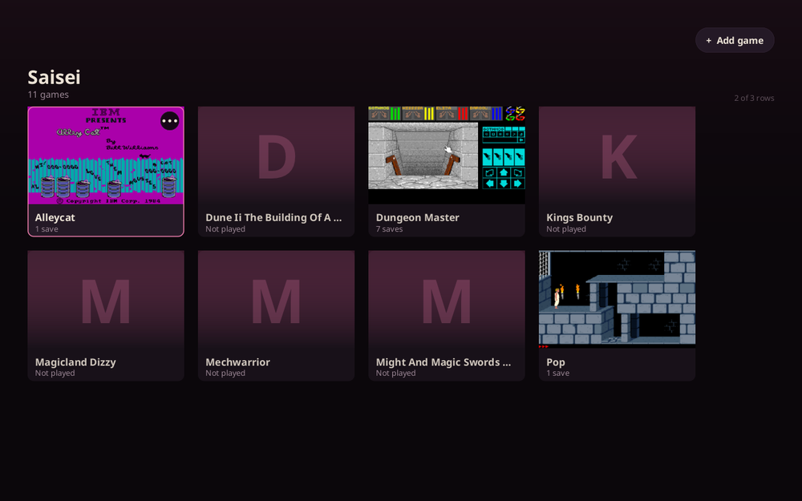
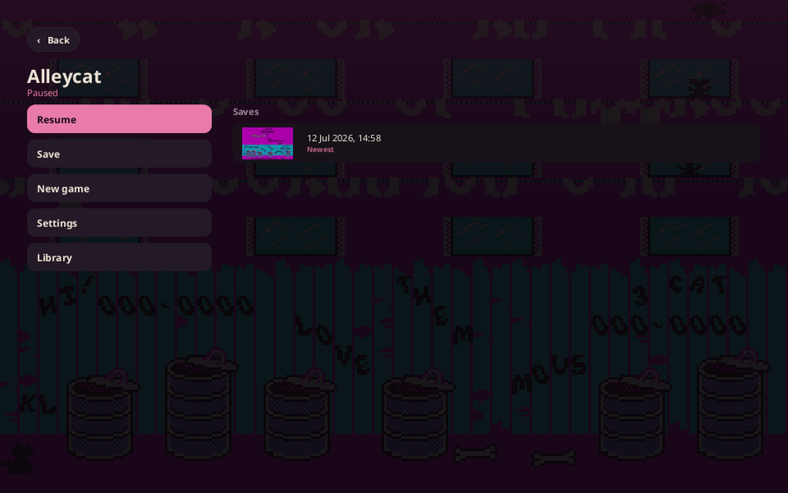

# Saisei

**再生 — "rebirth."** Take a DOS game you loved, and bring it back to life as real, native code.

The classics you grew up with are frozen in old binaries — playable only through an emulator, and a black box even then. Saisei thaws them out. As a game runs, Saisei decompiles it into readable Rust, compiles that with rustc, and runs *it*. The translated Rust **is** the game. No emulator sits in the middle — and nothing stays a black box.

So a game stops being a sealed artifact and becomes something you can open up:

- ▶️ **Play** — run the classics as fast, native programs.
- 🔍 **Explore** — read the Rust Saisei generates and finally see how your favorite game actually works.
- 🎨 **Remix** *(WIP)* — swap the art, rescore the music, rewrite the gameplay, and ship your own cut.

Packed, overlay-swapped, and self-modifying games all just work, because Saisei only ever compiles the bytes that are about to run. Old games don't have to stay frozen — give them a second life.

## Start playing

Two things to install — SDL2, for the window, and Rust. Then build once, and run it:

```bash
# Debian/Ubuntu:  sudo apt install build-essential libsdl2-dev
# macOS:          xcode-select --install && brew install sdl2
# Rust:           https://rustup.rs

cargo build --release                      # fetches the pinned toolchain itself
export PATH="$PWD/target/release:$PATH"    # or run ./target/release/saisei directly

saisei                                     # your library
```

### Your library



**To add a game, drop its zip on the window** — or paste a link into *Add game*. Grab one from an abandonware archive like [My Abandonware](https://www.myabandonware.com/); Saisei unpacks it, asks which executable starts the game if there's more than one, and it's yours from then on. No config files, no flags to weigh.

Pick a game and it plays, compiling each part of it to native code the moment control reaches it. Games you've played wear the last moment you saw them as their cover.

### While you're playing



**Press F12** and the game stops dead behind a menu. Save where you are, drop back into an earlier save, or just go back and carry on exactly where you were. Every save keeps a picture of the moment you made it, so you can tell one from another at a glance.

Your library is in there too — the same screens, in the same place, over the frozen frame instead of over the page. You can go and look at it, and come back, and the game will be exactly where you left it: browsing is not leaving. The only thing in there that really does end the game you paused is starting a different one, and that is the one thing the menu asks you about first.

The game really is stopped — not slowed, not skipping — and it can't tell that any time passed, so nothing lurches when you come back.

<sub>(F12 rather than something more obvious because GNOME and KDE grab most chords for themselves, and a shortcut the desktop eats is a feature that doesn't exist.)</sub>

### Doing more than playing

Everything else lives in `saisei-cli` — building bundles, driving a game from a script, and the reverse-engineering tools:

```bash
saisei-cli new-game "https://.../coolgame.zip"   # add a game from a terminal
saisei-cli run coolgame --headless               # no window: scripting and CI
saisei-cli help                                  # the full command list
```

To drive a game from a script — keystrokes, screenshots, deterministic replay — see [Driving a program](docs/playing.md).

## Where Saisei is going

Playing is the front door. The point is to make these games **open to tinker with** again — that's the direction:

- 🤖 **Explore a game with an AI agent** *(WIP)* — turn the generated Rust into a map of how a game works. *(guide coming soon)*
- 🩹 **Write patches** *(WIP)* — small, shareable mods that hook a game's own functions with no source changes. → [patch bundles](patches/README.md)
- 🎨 **Replace art, music, and gameplay** *(WIP)* — swap a game's resources and behavior while it runs. *(coming soon)*
- ❄️ **Freeze to a standalone binary** *(WIP)* — collect the compiled pieces into one native executable for the target of your choice: desktop (Linux, macOS, Windows) and eventually mobile (Android, iOS), with no compiler required to run it. Your childhood DOS game, native on your phone. *(coming soon)*

*(WIP = work in progress. These are the direction, not promises with dates — links land here as each one ships.)*

## How it works

At run time Saisei loads the program image, takes the entry point from the MZ header, and JIT-compiles each code segment the first time control reaches it: decode → lossless IR → Rust → rustc → `dlopen`. Nothing is decoded ahead of time, and compiled chunks are keyed by the bytes that are actually live — so a decompressed or overlaid region is recompiled from whatever is really there. The full design is in the [architecture overview](docs/architecture.md).

## Tested games

Saisei's x86, BIOS, and DOS emulation is **still being built out, and many games do not work yet** — they hang, glitch, or stop on something we haven't implemented. These are the ones known to play:

- **Zeliard**
- **Prince of Persia**
- **Dungeon Master**
- **Alley Cat**

Every game you try is a test case, so please tell us either way: if one works, report it and we'll add it to this list; if one breaks, [open an issue](https://github.com/saisei-dev/saisei/issues) with the game and how far it got. A game that stops on an unimplemented port or an unfaithful instruction is exactly the signal that pushes the emulation forward.

## Contributing

Saisei is early and there's plenty to build — the dev setup, the design docs, and how to report a game are in [CONTRIBUTING.md](CONTRIBUTING.md).

## License

Saisei is released under the MIT License — see [LICENSE](LICENSE). The license covers the recompiler and runtime only. The DOS games you run through it are yours; you are responsible for having the right to use them, and none are ever included here.
